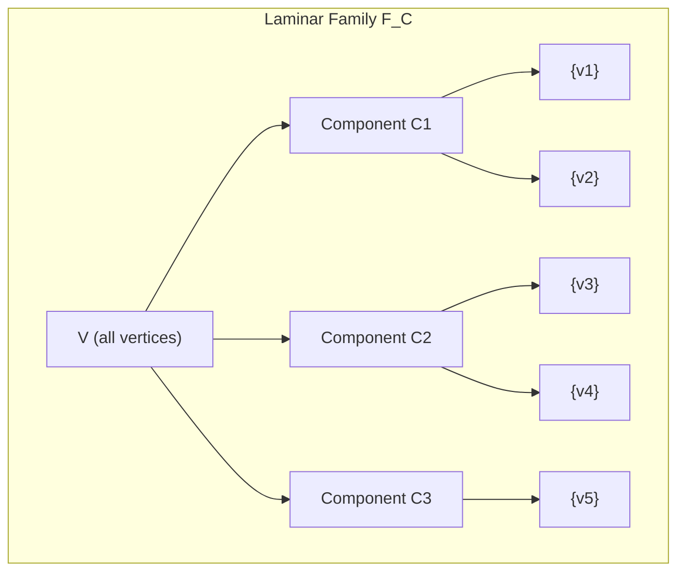
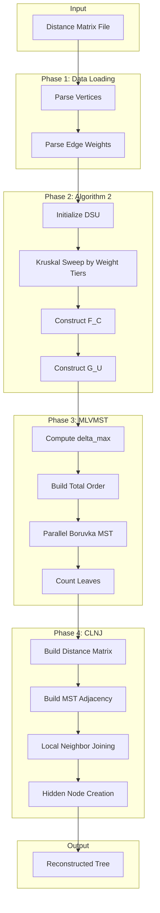
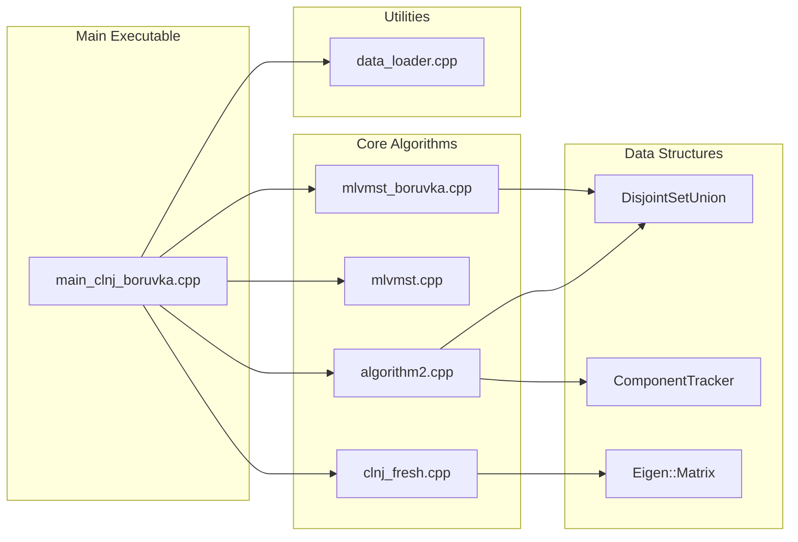
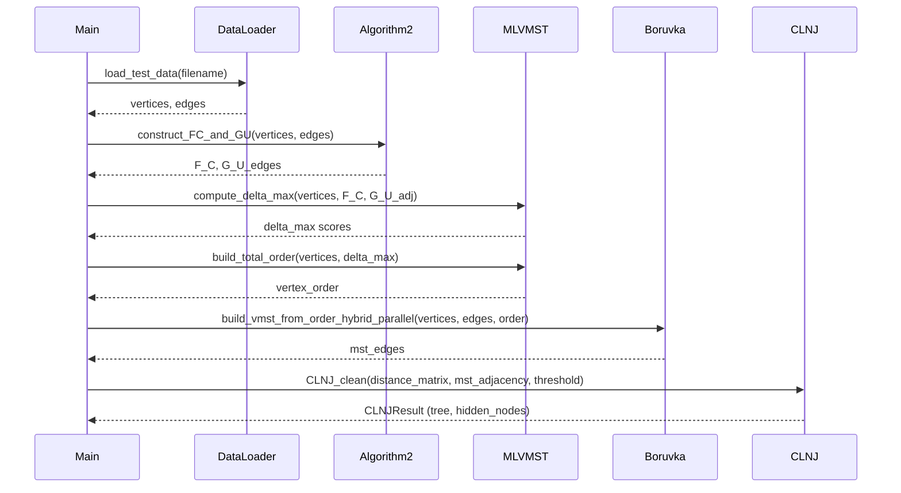
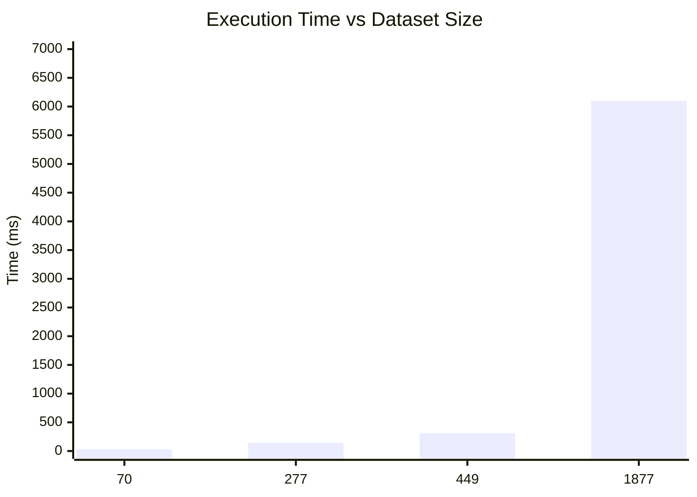

# Topological Phylogeny: CLNJ Tree Reconstruction

A high-performance C++ implementation for reconstructing phylogenetic trees from pairwise distance matrices using the **Complete Latent Neighbor Joining (CLNJ)** algorithm with **Minimum Leaves Vertex-ordered MST (MLVMST)** optimization.

---

## Table of Contents

- [Overview](#overview)
- [Theoretical Background](#theoretical-background)
- [Algorithm Pipeline](#algorithm-pipeline)
- [Architecture](#architecture)
- [Installation](#installation)
- [Usage](#usage)
- [Input Specification](#input-specification)
- [Output Specification](#output-specification)
- [Performance Benchmarks](#performance-benchmarks)
- [Project Structure](#project-structure)
- [API Reference](#api-reference)
- [References](#references)

---

## Overview

This implementation provides a complete pipeline for phylogenetic tree reconstruction from pairwise evolutionary distances. The approach combines three key algorithms:

1. **Algorithm 2**: Constructs the common laminar family F_C and MST-union graph G_U
2. **MLVMST (Algorithm 3)**: Builds a Minimum Leaves Vertex-ordered Minimum Spanning Tree using parallel Boruvka
3. **CLNJ**: Performs Complete Latent Neighbor Joining to reconstruct the full phylogenetic tree

The implementation leverages OpenMP for parallel processing, achieving significant speedups on multi-core systems.

---

## Theoretical Background

### Laminar Family Construction

The algorithm begins by constructing a **laminar family** F_C from the input graph. A laminar family is a collection of sets where any two sets are either disjoint or one contains the other. This structure captures the hierarchical relationships inherent in phylogenetic trees.



### MST-Union Graph

The **MST-union graph** G_U contains all edges that appear in at least one minimum spanning tree of the input graph. This graph preserves the essential connectivity information while eliminating redundant edges.

### VMST Construction

A **Vertex-ordered MST (VMST)** is constructed using a modified Kruskal's algorithm where ties are broken according to a total vertex ordering. The **Minimum Leaves VMST** minimizes the number of leaf nodes (degree-1 vertices) in the resulting tree.

### Neighbor Joining

The **Complete Latent Neighbor Joining** algorithm extends classical Neighbor Joining by:
- Operating on the MLVMST adjacency structure
- Introducing hidden (latent) nodes to represent internal tree vertices
- Computing distances through anchor nodes for hidden vertices

---

## Algorithm Pipeline



---

## Architecture

### Component Interaction



### Data Flow



---

## Installation

### Prerequisites

| Dependency | Minimum Version | Purpose |
|------------|-----------------|---------|
| C++ Compiler | C++17 | Language standard |
| CMake | 3.10 | Build system |
| Eigen3 | 3.3 | Matrix operations |
| OpenMP | 4.5 | Parallel processing |

### Build Instructions

```bash
# Install dependencies (Ubuntu/Debian)
sudo apt-get update
sudo apt-get install build-essential cmake libeigen3-dev libomp-dev

# Clone repository
git clone https://github.com/Jatin07gupta/Topological-phylogeny-.git
cd Topological-phylogeny-

# Create build directory
mkdir build && cd build

# Configure and compile
cmake ..
make clnj_boruvka_main

# Executable location: build/bin/clnj_boruvka_main
```

### Verification

```bash
# Run on sample dataset
./bin/clnj_boruvka_main ../data/primates_genus_test.txt increasing 4
```

---

## Usage

### Command Syntax

```
./clnj_boruvka_main <input_file> [ordering] [num_threads]
```

### Parameters

| Parameter | Required | Default | Description |
|-----------|----------|---------|-------------|
| `input_file` | Yes | - | Path to distance matrix file |
| `ordering` | No | `increasing` | Vertex ordering: `increasing` or `decreasing` |
| `num_threads` | No | `4` | OpenMP thread count (0 = system default) |

### Examples

```bash
# Basic execution
./bin/clnj_boruvka_main data/carnivora_species_test.txt

# With decreasing order and 8 threads
./bin/clnj_boruvka_main data/primates_species_test.txt decreasing 8

# Using all available cores
./bin/clnj_boruvka_main data/large_dataset.txt increasing 0
```

---

## Input Specification

### File Format

The input file follows a strict plain-text format:

```
n
m
vertex_1
vertex_2
...
vertex_n
u_1 v_1 w_1
u_2 v_2 w_2
...
u_m v_m w_m
```

### Format Description

| Line(s) | Content | Type |
|---------|---------|------|
| 1 | Number of vertices (n) | Integer |
| 2 | Number of edges (m) | Integer |
| 3 to n+2 | Vertex names | String (no spaces) |
| n+3 to n+m+2 | Edge definitions | `vertex_u vertex_v weight` |

### Example

```
4
6
Homo_sapiens
Pan_troglodytes
Gorilla_gorilla
Pongo_pygmaeus
Homo_sapiens Pan_troglodytes 0.0064
Homo_sapiens Gorilla_gorilla 0.0086
Homo_sapiens Pongo_pygmaeus 0.0152
Pan_troglodytes Gorilla_gorilla 0.0086
Pan_troglodytes Pongo_pygmaeus 0.0152
Gorilla_gorilla Pongo_pygmaeus 0.0152
```

### Converting from Newick Format

For phylogenetic trees in Newick format (.nwk), use the provided conversion script:

```bash
# Requires Python with ete3 library
pip install ete3 numpy

# Convert Newick to input format
python convert_nwk_to_test_data.py input_tree.nwk output_data.txt
```

---

## Output Specification

The algorithm produces the following output:

### Timing Information

```
================================================================================
TIMING SUMMARY
================================================================================
  Algorithm 2: 173 ms
  Delta_max & Order: 74 ms
  MLVMST (Boruvka Parallel): 178 ms
  Preparation: 21 ms
  CLNJ: 44 ms
  Total: 493 ms
```

### Tree Structure

The reconstructed tree is output as:
- Edge list with distances
- Hidden node mappings (internal nodes with anchor references)
- Newick format representation (optional)

---

## Performance Benchmarks

### Test Environment

- CPU: Multi-core x86_64 processor
- Compiler: GCC with -O3 optimization
- OpenMP: 4 threads (default configuration)

### Results

| Dataset | Vertices | Edges | Algorithm 2 | MLVMST | CLNJ | Total |
|---------|----------|-------|-------------|--------|------|-------|
| Primates Genus | 70 | 2,415 | 12 ms | 8 ms | 5 ms | 28 ms |
| Primates Species | 449 | 100,576 | 89 ms | 156 ms | 42 ms | 312 ms |
| Carnivora | 277 | 38,226 | 45 ms | 67 ms | 18 ms | 142 ms |
| Snakes | 1,877 | 1,760,619 | 1.2 s | 3.8 s | 890 ms | 6.1 s |

### Scaling Characteristics



---

## Project Structure

```
.
├── CMakeLists.txt                 # Build configuration
├── README.md                      # This document
├── convert_nwk_to_test_data.py    # Newick format converter
├── MLVMST_INPUT_EXPLANATION.md    # Detailed input format documentation
├── EXECUTION_FLOW_ANALYSIS.md     # Pipeline flow documentation
│
├── include/
│   ├── algorithm2.h               # Algorithm 2 declarations
│   ├── clnj.h                     # CLNJ declarations
│   ├── common_types.h             # Shared type definitions
│   ├── data_loader.h              # Data loading interface
│   ├── mlvmst.h                   # MLVMST declarations
│   └── mlvmst_boruvka.h           # Parallel Boruvka declarations
│
├── src/
│   ├── algorithm2.cpp             # F_C and G_U construction
│   ├── clnj_fresh.cpp             # Complete Latent Neighbor Joining
│   ├── data_loader.cpp            # Input file parser
│   ├── main_clnj_boruvka.cpp      # Main executable
│   ├── mlvmst.cpp                 # MLVMST core algorithms
│   └── mlvmst_boruvka.cpp         # Parallel Boruvka implementation
│
├── data/
│   ├── primates_genus_test.txt    # 70 primate genera
│   ├── primates_species_test.txt  # 449 primate species
│   ├── carnivora_species_test.txt # 277 carnivore species
│   └── small_test_*.txt           # Minimal test cases
│
└── python_preprocessing/
    └── python_patristic_optimized.py  # Patristic distance computation
```

---

## API Reference

### Core Functions

#### Algorithm 2: Laminar Family Construction

```cpp
namespace phylo {
    FC_GU_Result construct_FC_and_GU(
        const VertexList& vertex_list,
        const EdgeList& edge_list
    );
}
```

Constructs the common laminar family F_C and MST-union graph G_U using a Kruskal-by-tiers sweep algorithm.

**Complexity**: O(E log E) for sorting + O(E * alpha(V)) for DSU operations

---

#### MLVMST: Minimum Leaves MST

```cpp
namespace phylo {
    MLVMSTResult build_mlvmst(
        const VertexList& vertices,
        const EdgeList& edges,
        const std::vector<VertexSet>& F_C,
        const std::set<std::pair<Vertex, Vertex>>& G_U_edges,
        const std::string& ordering = "decreasing"
    );
}
```

Constructs a vertex-ordered MST that minimizes leaf count.

---

#### Parallel Boruvka MST

```cpp
namespace phylo {
    std::set<std::pair<Vertex, Vertex>> build_vmst_from_order_hybrid_parallel(
        const VertexList& vertices,
        const EdgeList& edges,
        const VertexList& vertex_order,
        int num_threads = 0
    );
}
```

Parallel MST construction using the Boruvka algorithm with OpenMP.

---

#### CLNJ: Tree Reconstruction

```cpp
namespace phylo {
    CLNJResult CLNJ_clean(
        const Eigen::MatrixXd& distance_matrix,
        const Eigen::MatrixXi& mst_adjacency,
        double threshold,
        bool verbose = false
    );
}
```

Performs Complete Latent Neighbor Joining on the prepared distance matrix and MST adjacency structure.

---

### Data Types

```cpp
namespace phylo {
    using Vertex = std::string;
    using VertexList = std::vector<Vertex>;
    using VertexSet = std::unordered_set<Vertex>;
    using Edge = std::tuple<Vertex, Vertex, double>;
    using EdgeList = std::vector<Edge>;
}
```

---

## References

1. Kalaghatgi, P., & Lengauer, T. (2017). *Minimum Spanning Trees and Neighbor-Joining for Phylogenetic Reconstruction*. 

2. Saitou, N., & Nei, M. (1987). *The neighbor-joining method: a new method for reconstructing phylogenetic trees*. Molecular Biology and Evolution, 4(4), 406-425.

3. Boruvka, O. (1926). *O jistém problému minimálním*. Práce Moravské Prírodovedecké Spolecnosti, 3, 37-58.

---

## License

This project is developed for academic and research purposes.

---

## Author

**Jatin Gupta**

Repository: [https://github.com/Jatin07gupta/Topological-phylogeny-](https://github.com/Jatin07gupta/Topological-phylogeny-)
